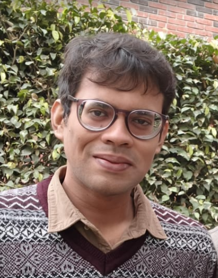

  Ojas Kumar

ओजस कुमार

Research Associate 
<a href="https://scdlds.ashoka.edu.in/">Safexpress Centre for Data, Learning and Decision Sciences</a>

<a href="mailto:ojas.kumar@ashoka.edu.in">ojas.kumar@ashoka.edu.in</a> · <a href="mailto:ojaskumar00@gmail.com">ojaskumar00@gmail.com</a>

I am a Research Associate at SCDLDS, where I am part of the finance group. I work at the intersection of quantitative finance and machine learning, and I am particularly interested in portfolio optimization.

I studied at Ashoka University as an undergraduate before completing a master’s degree in mathematics at the Chennai Mathematical Institute in 2025. I found my way back to Ashoka soon after, but this time as a researcher.

I also enjoy teaching. I have taught at Ashoka as a Teaching Fellow and have been involved with the Lodha Genius Programme for the past four years—first as an intern, and for the past two years as Visiting Faculty.
